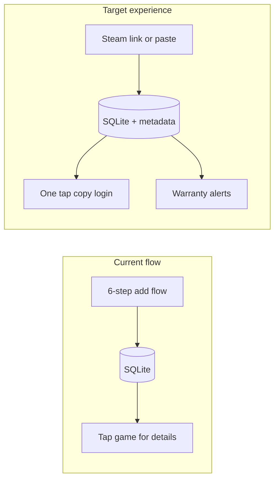
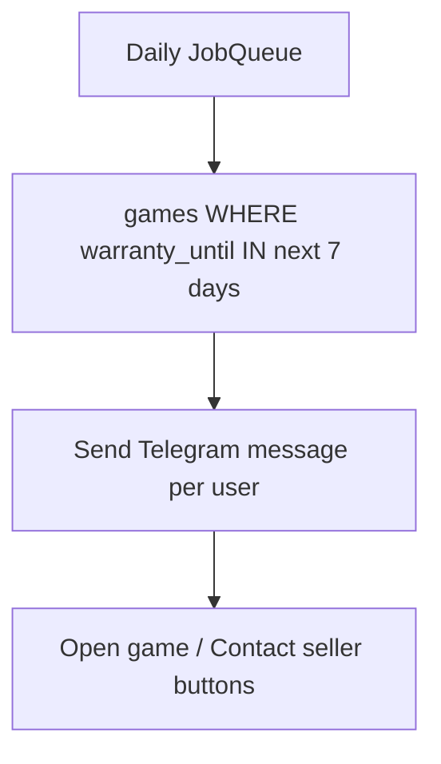

# Steam Library Bot — Feature Roadmap

## What you have today

Your bot is a solid credential vault: add/view/delete games, photo covers, search by name, basic stats, per-user isolation, persistent menu. What it lacks is **speed** (too many steps to get credentials), **lifecycle tracking** (warranties, sellers, spend), and **smart input** (manual entry for everything).



---

## Tier 1 — High impact, low effort (start here)

### 1. One-tap copy credentials
**Why:** The #1 reason users open the bot is to log in. Today they must read and manually copy username/password from a caption.

**What to build:**
- On the game detail screen, add inline buttons: `Copy Username` and `Copy Password` using Telegram's `copy_text` button type (python-telegram-bot `CopyTextButton`).
- Optional: `Open Store` button linking to `store_url`.

**Touches:** [bot.py](c:\Users\Administrator\Documents\SteamLibraryBot\bot.py) — `view_game`, `safe_send_game_details` keyboard only.

---

### 2. Edit game (without delete + re-add)
**Why:** Typos in password, updated seller notes, new warranty date — users currently must delete and repeat the 6-step flow.

**What to build:**
- `Edit` button on game detail → pick field (name, store, username, password, notes, photo).
- Reuse existing conversation pattern from add flow, but pre-fill `context.user_data` from `get_game_by_id`.
- New DB function: `update_game(user_id, game_id, **fields)`.

**Touches:** [database.py](c:\Users\Administrator\Documents\SteamLibraryBot\database.py), [bot.py](c:\Users\Administrator\Documents\SteamLibraryBot\bot.py) — new edit conversation handler.

---

### 3. Favorites / Recent games
**Why:** Most users play the same 2–3 shared accounts repeatedly. Scrolling a long library is friction.

**What to build:**
- DB: `is_favorite INTEGER DEFAULT 0`, `last_viewed TEXT` on `games`.
- Update `last_viewed` when user opens a game.
- New menu item: **Recent** (last 5 viewed) and **Favorites** (star toggle on detail screen).
- Show favorites at the top of the library list.

**Touches:** [database.py](c:\Users\Administrator\Documents\SteamLibraryBot\database.py) migration, [bot.py](c:\Users\Administrator\Documents\SteamLibraryBot\bot.py) library list + detail view.

---

### 4. Richer search
**Why:** Search only matches `game_name` today. Users often remember the store or seller, not the exact title.

**What to build:**
- Extend `search_games` to search `store_url`, `username`, `notes`, and (after Tier 2) `seller_name`.
- Optional filter buttons on library: **By store**, **Favorites only**.

**Touches:** [database.py](c:\Users\Administrator\Documents\SteamLibraryBot\database.py) `search_games` query, [bot.py](c:\Users\Administrator\Documents\SteamLibraryBot\bot.py) search + library UI.

---

## Tier 2 — Tracking (your priority)

### 5. Seller + warranty fields
**Why:** Shared accounts almost always come with a seller contact and a warranty window (e.g. "30 days replacement"). This is the biggest tracking gap in your schema.

**What to build:**

| New column | Purpose |
|---|---|
| `seller_contact` | Telegram @username, Discord, or store chat link |
| `price_paid` | Optional float + currency |
| `warranty_until` | ISO date — when support ends |
| `purchase_notes` | Keep existing `notes` for login extras (2FA, etc.) |

- Show warranty status on detail: `Active (12 days left)` / `Expired`.
- Stats page additions: total spent, games expiring this month.

**DB migration pattern:** Same as existing `user_id` migration in `_migrate_db()` — safe `ALTER TABLE` checks.

---

### 6. Warranty expiry reminders
**Why:** Users forget when warranty ends and lose the ability to get replacements.

**What to build:**
- `python-telegram-bot` `JobQueue` (built into `Application`).
- Daily job: find games where `warranty_until` is in 7 days, 3 days, or today.
- Send user a message: *"Warranty for Cyberpunk 2077 expires in 3 days. Seller: @xyz"*
- User setting: `reminders_enabled` on `users` table (opt-out).

**Touches:** [database.py](c:\Users\Administrator\Documents\SteamLibraryBot\database.py), [bot.py](c:\Users\Administrator\Documents\SteamLibraryBot\bot.py) `main()` job setup.



---

### 7. Better stats dashboard
**Why:** Current stats (total games, unique stores) are minimal.

**Add:**
- Total money spent (sum of `price_paid`)
- Games by store (top 3 stores)
- Warranties expiring soon count
- Library growth (games added this month)

**Touches:** [database.py](c:\Users\Administrator\Documents\SteamLibraryBot\database.py) new `get_extended_stats()`, [bot.py](c:\Users\Administrator\Documents\SteamLibraryBot\bot.py) `show_stats` / `reply_stats`.

---

## Tier 3 — Automation (your priority)

### 8. Steam link auto-fill (name + cover)
**Why:** Biggest time-saver during add flow. User pastes `https://store.steampowered.com/app/1091500/...` and bot fills name + cover image automatically.

**What to build:**
- After game name step (or new optional first step): detect Steam URL via regex.
- Call Steam Store API: `https://store.steampowered.com/api/appdetails?appids={id}` (no API key needed).
- Auto-set `game_name` from `data[name]` and `image_url` from `header_image`.
- User confirms or edits before continuing to credentials.

**Caveat:** API can rate-limit; add a simple try/except fallback to manual entry.

**Touches:** New small module e.g. `steam.py`, [bot.py](c:\Users\Administrator\Documents\SteamLibraryBot\bot.py) add flow.

---

### 9. Quick-add / paste template
**Why:** Sellers often send credentials in a fixed format. Six prompts is slow.

**What to build:**
- New entry: **Quick Add** — user pastes a block like:
  ```
  Game: Elden Ring
  User: foo@email.com
  Pass: bar123
  Store: g2g.com/...
  ```
- Parser extracts fields with regex; show preview for confirm.
- Alternatively: forward a seller message → bot tries to parse it.

**Touches:** [bot.py](c:\Users\Administrator\Documents\SteamLibraryBot\bot.py) new conversation or single-step handler.

---

### 10. Bulk import / export (JSON)
**Why:** Backup, migration, or importing an existing spreadsheet.

**What to build:**
- `/export` — bot sends a `.json` file of all user's games (passwords included — warn user).
- `/import` — user uploads JSON, bot merges or replaces with preview.

**Touches:** [database.py](c:\Users\Administrator\Documents\SteamLibraryBot\database.py), [bot.py](c:\Users\Administrator\Documents\SteamLibraryBot\bot.py).

---

## Tier 4 — Nice to have (later)

- **Tags** (`fps`, `rpg`, `offline`) — filter library by tag
- **PIN lock** before showing passwords — extra security layer
- **Encrypt passwords at rest** — SQLite + Fernet key in `config.py`
- **Pagination** — when library exceeds ~20 games, split into pages
- **Sort options** — A–Z, newest, by store

---

## Recommended build order

Based on your priorities (daily use + tracking + automation):

| Phase | Features | Est. effort |
|---|---|---|
| **Phase 1** | Copy credentials, Edit game, Favorites/Recent | 1–2 days |
| **Phase 2** | Seller + warranty fields, Extended stats | 1 day |
| **Phase 3** | Warranty reminders (JobQueue) | 0.5 day |
| **Phase 4** | Steam link auto-fill | 0.5–1 day |
| **Phase 5** | Quick-add paste, Richer search | 1 day |
| **Phase 6** | Import/export | 0.5 day |

Phase 1 alone would make the bot feel dramatically easier for everyday login use. Phase 2–3 adds the tracking value that spreadsheets can't match. Phase 4–5 cuts add time in half.

---

## Schema sketch (Phase 2 migration)

```sql
ALTER TABLE games ADD COLUMN seller_contact TEXT;
ALTER TABLE games ADD COLUMN price_paid REAL;
ALTER TABLE games ADD COLUMN currency TEXT DEFAULT 'USD';
ALTER TABLE games ADD COLUMN warranty_until TEXT;
ALTER TABLE games ADD COLUMN is_favorite INTEGER DEFAULT 0;
ALTER TABLE games ADD COLUMN last_viewed TEXT;

ALTER TABLE users ADD COLUMN reminders_enabled INTEGER DEFAULT 1;
```

All via the existing `_migrate_db()` pattern in [database.py](c:\Users\Administrator\Documents\SteamLibraryBot\database.py) — no need to wipe existing data.

---

## What I would not add (low value for your use case)

- **Social sharing of credentials** — security risk, not useful for shared accounts
- **Steam login automation** — against ToS, fragile, high risk
- **Web dashboard** — Telegram is the right UI for this; a web app is a large detour unless you have many power users
